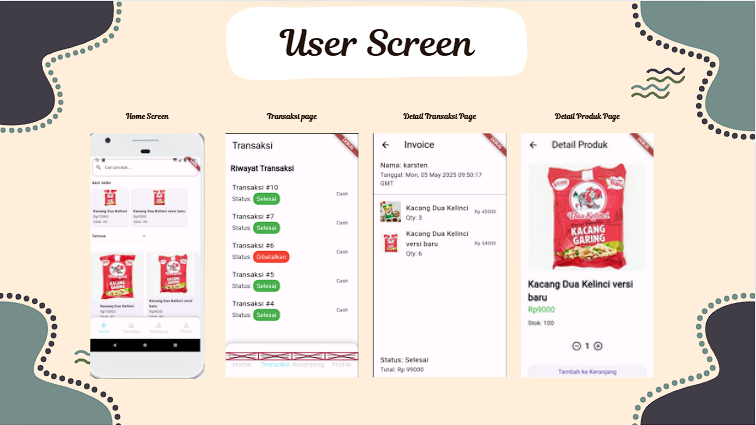
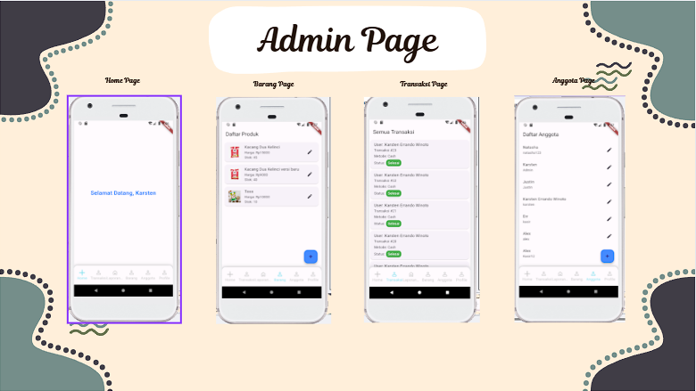
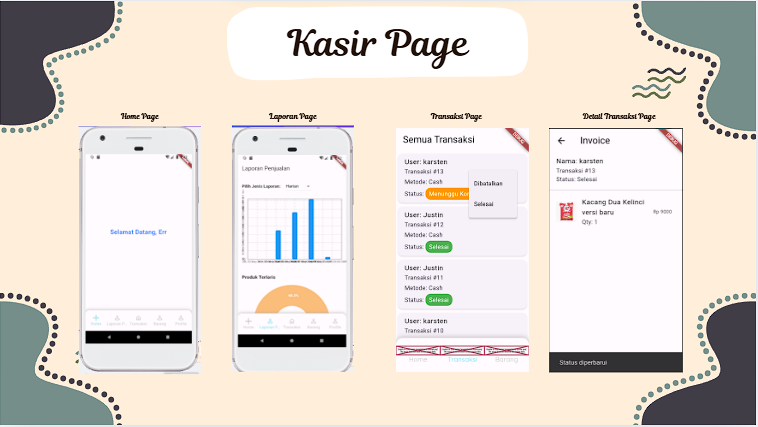

# 📦 app_koperasi

Aplikasi koperasi berbasis mobile untuk mempermudah karyawan pabrik dua kelinci dalam melihat produk, menambahkan ke keranjang, melakukan checkout, dan melihat riwayat transaksi. Dibangun menggunakan **Flutter** (frontend) dan **Flask + MySQL** (backend).

---

## 📌 Fitur Utama

- 🔐 Registrasi & Login Pengguna
- 🛍️ Daftar Produk
- 🛒 Keranjang Belanja
- 💳 Pemilihan Metode Pembayaran
- 📦 Checkout & Transaksi
- 🧾 Invoice & Riwayat Transaksi
- 📉 Pengurangan Stok Otomatis
- 👨‍💼 Mode Kasir (Konfirmasi Pembayaran)

---

## 🛠️ Teknologi

### Backend

- Python 3 + Flask
- MySQL
- Flask-Cors, Flask-MySQLdb

### Frontend

- Flutter
- HTTP Package
- Provider (opsional untuk state management)

---

## 🚀 Cara Menjalankan

### 1. Backend (Flask)

```bash
cd backend
pip install -r requirements.txt
python app.py
```

### 2. Frontend (Flutter)

```bash
cd frontend
flutter pub get
flutter run
```

> Ganti IP `http://10.0.2.2:5000` di Flutter jika menggunakan device fisik

---

## 🧪 Endpoint API (Contoh)

| Method | Endpoint        | Deskripsi                |
| ------ | --------------- | ------------------------ |
| GET    | /produk         | Ambil semua produk       |
| POST   | /register       | Registrasi pengguna      |
| POST   | /login          | Login & terima token     |
| POST   | /checkout       | Tambah ke keranjang      |
| GET    | /keranjang/<id> | Ambil isi keranjang user |
| POST   | /transaksi      | Lanjutkan ke transaksi   |
| GET    | /transaksi/<id> | Riwayat transaksi        |
| GET    | /invoice/<id>   | Lihat detail transaksi   |

---

## 🧾 Contoh Struktur Tabel MySQL

```sql
CREATE TABLE produk (
    'id_produk' int(11) NOT NULL,
  'nama' varchar(255) NOT NULL,
  'stock' int(11) NOT NULL,
  'harga' int(11) NOT NULL,
  'gambar' varchar(255) NOT NULL,
  'id_kategori' int(11) NOT NULL,
  'terjual' int(11) DEFAULT 0
);
```

---

## Screenshots

### User Screen



### Admin Screen



### Kasir Screen



---

## 📋 Catatan Tambahan

- Pastikan Server database berjalan
- Pastikan backend berjalan sebelum Flutter dijalankan.
- Gunakan Postman untuk menguji API terlebih dahulu.
- Di emulator Android, gunakan `10.0.2.2` untuk mengakses `localhost`.

---

## 👨‍💻 Authors

- [@sixxkr](https://www.github.com/sixxkr)
